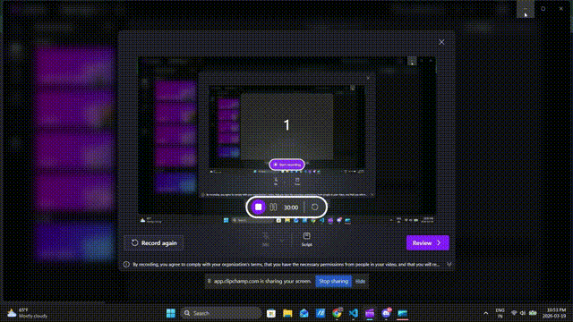
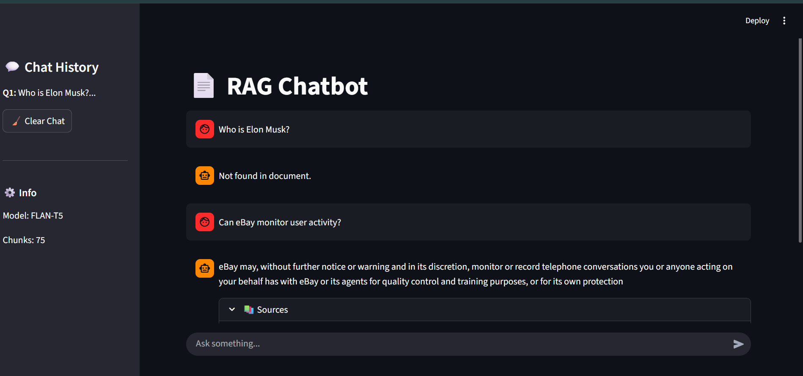
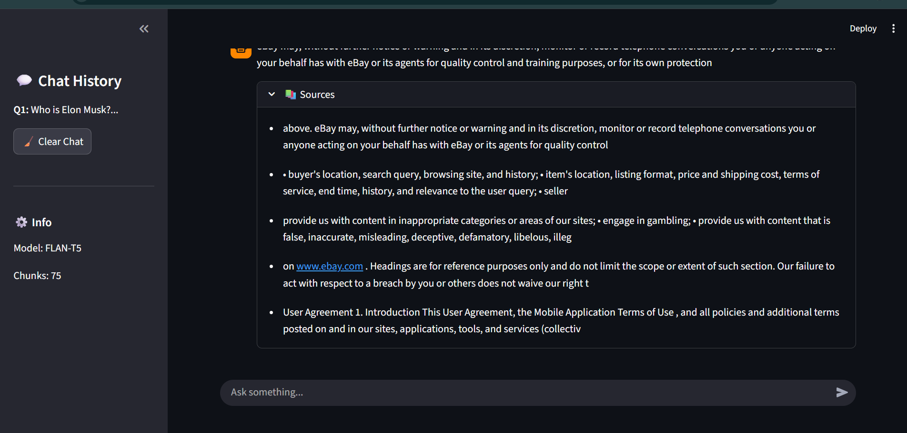
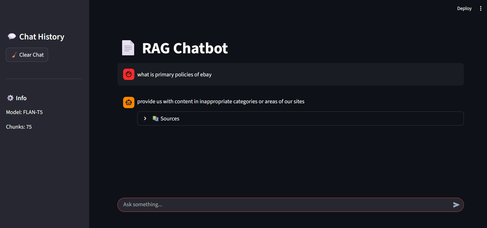
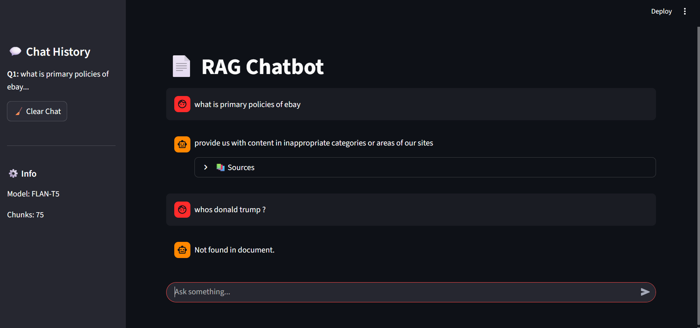

# 📄 RAG Chatbot with Streaming (Amlgo Labs Assignment)

## 🚀 Overview
This project implements a **Retrieval-Augmented Generation (RAG) chatbot** that answers user queries strictly based on a given document.

It combines:
- Semantic search using **FAISS**
- Context-aware response generation using **FLAN-T5**
- A **Streamlit-based chat interface with streaming responses**

---

## ⚙️ Features
- 📄 Document ingestion and chunking (100–200 words)
- 🔍 Semantic retrieval using FAISS
- 🤖 Grounded response generation (no hallucination)
- ⚡ Streaming responses (word-by-word)
- 💬 Chat-style UI with chat history
- 📚 Source display for transparency
- ❌ Fallback for irrelevant queries ("Not found in document")

---

## 🧠 Architecture


PDF → Chunking → Embeddings → FAISS
↓
User Query → Retrieval → Context → LLM → Streaming → UI


---

## 📁 Project Structure


rag-chatbot/
│
├── data/ # input document
├── chunks/ # processed chunks
├── vectordb/ # FAISS index
│
├── src/
│ ├── ingest.py
│ ├── retriever.py
│ └── generator.py
│
├── assets/ # demo + screenshots
│ ├── demo.gif
│ ├── preview_one.png
│ ├── preview_two.png
│ ├── preview_three.png
│ └── preview_four.png
│
├── app.py # Streamlit app
├── requirements.txt
└── README.md


---

## 🛠️ Tech Stack
- Python
- Streamlit
- Sentence Transformers (`bge-small-en`)
- FAISS (vector database)
- HuggingFace Transformers (`flan-t5-base`)

---

## ▶️ How to Run

### 1. Install dependencies
```bash
pip install -r requirements.txt
2. Run the app
streamlit run app.py
🧪 Sample Queries

What data does eBay collect?

What are the user responsibilities?

What policies are mentioned?

❌ Irrelevant Query Handling

Who is Elon Musk? → Not found in document

🎞️ Demo
<p align="center">  </p>
📸 Screenshots
🖥️ Chat UI
<p align="center">  </p>
💬 Streaming Response
<p align="center">  </p>
⚡ Retrieval + Answer
<p align="center">  </p>
📚 Source Display
<p align="center">  </p>
⚠️ Notes

Uses similarity threshold + keyword filtering to reduce hallucinations

Answers are strictly grounded in retrieved document chunks

👨‍💻 Author

Omkar Goje
